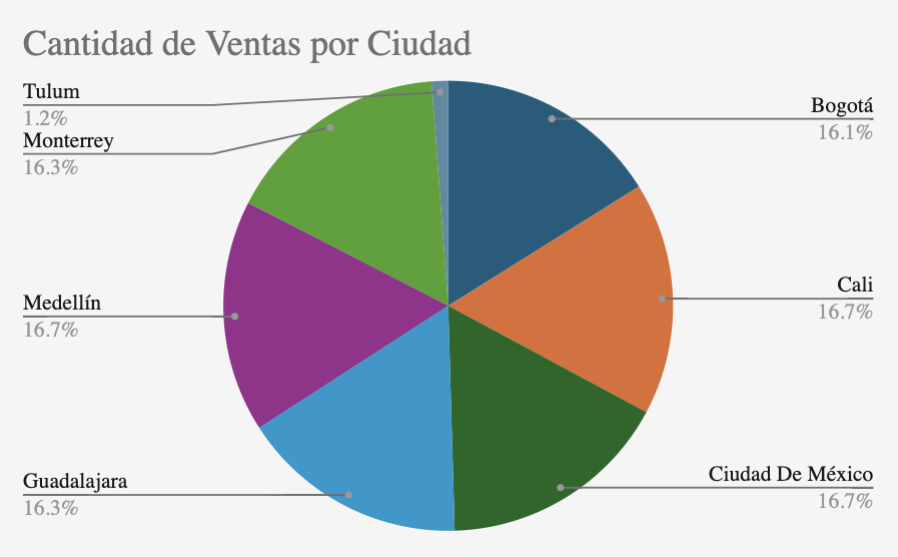

# 📊 Data Cleaning and Sales Analysis in Spreadsheets (Q4 2024)

## 📌 Business Context
VentaExpress is a growing e-commerce company that sells technology products — laptops, phones, tablets, and accessories — across multiple cities in **Mexico and Colombia**.

As a **junior data analyst**, I was tasked with analyzing **raw Q4 2024 sales data (October–December)** to support the creation of an **executive-level report**. The dataset was unstructured and contained common real-world data issues that required cleaning, validation, and transformation before analysis.

---

## 🎯 Project Objective
Transform a raw and messy sales dataset into a **clean, structured, and insightful report** by:

- Identifying and documenting data quality issues  
- Cleaning and organizing the data using spreadsheets  
- Calculating key business metrics  
- Creating visualizations to communicate insights clearly  

---

## 🗂 Dataset Overview
- **File:** `ventas_q4_2024_raw.csv`
- **Period:** October – December 2024 (Q4)
- **Countries:** Mexico, Colombia
- **Product categories:** Laptops, Phones, Tablets, Headphones

### Identified Data Issues
- Inconsistent date and currency formats  
- Duplicate transactions  
- Missing values  
- Combined and poorly labeled columns  
- Lack of documentation  

---

## 🧹 Data Cleaning Process
All transformations were performed in **Google Sheets / Excel** following a structured approach:

- Standardized date formats  
- Removed duplicate records  
- Validated numeric fields (prices, quantities)  
- Handled missing values logically  
- Split combined fields (e.g., city and country)  
- Renamed columns using clear, consistent naming conventions  

Each step was documented to ensure transparency and reproducibility.

---

## 📈 Key Business Metrics

| Metric | Result |
|------|------|
| Total Q4 Revenue | $1,254,932.94 |
| Total Transactions | 3,042 |
| Average Items per Transaction | 3 |
| Top-Selling Product (by quantity) | Laptop – Oficina – 32GB |
| City with Highest Total Sales | Cali |
| Best Performing Month | December |
| Average Price per Product Category | $1,275.85 |

**Insight:**  
The results show strong end-of-year seasonality, with **December driving peak performance** and **Cali emerging as the highest-revenue city**.

---

## 📊 Visualizations

### Sales Volume by City
This pie chart shows the distribution of total sales across major cities in Mexico and Colombia, highlighting where demand is most concentrated.

---

### Daily Items Sold (Oct–Dec 2024)
This line chart illustrates daily sales trends throughout Q4 2024, revealing increased activity toward the end of the quarter.

---

## 🔍 Key Insights
- Sales are highly concentrated in a small number of cities  
- December significantly outperformed October and November  
- Laptops were the dominant product category by quantity sold  
- Daily sales patterns suggest seasonal demand spikes toward year-end  

---

## 🛠 Tools Used
- Google Sheets / Excel  
- Pivot tables  
- Spreadsheet formulas  
- Data cleaning and validation techniques  
- Data visualization charts  

---

## ✅ Outcome
The final deliverable was a **clean, executive-ready sales report** that transforms messy real-world data into **clear, actionable insights**, demonstrating foundational skills in data cleaning, analysis, and business communication.

This project reflects real-world analyst responsibilities and serves as a portfolio example of spreadsheet-based data analysis.

